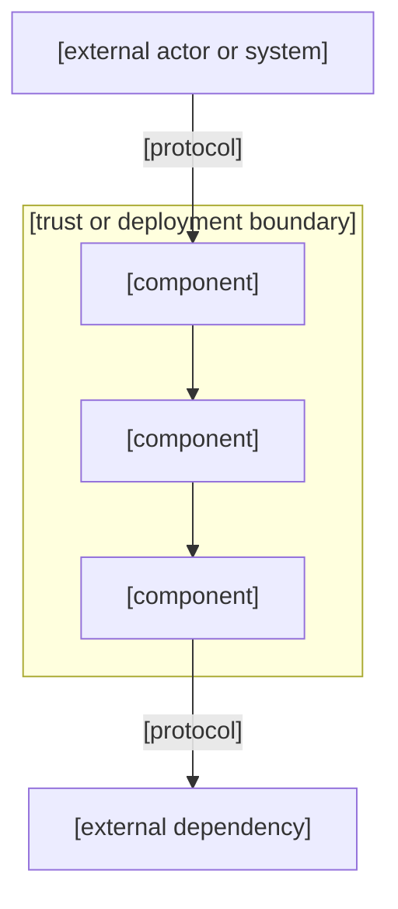
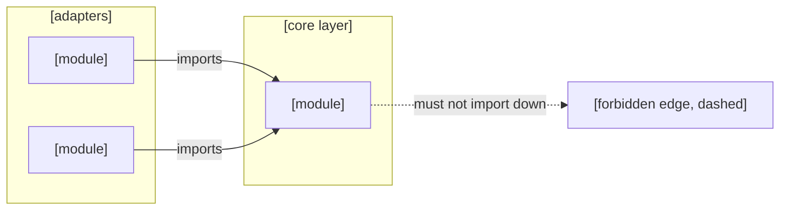
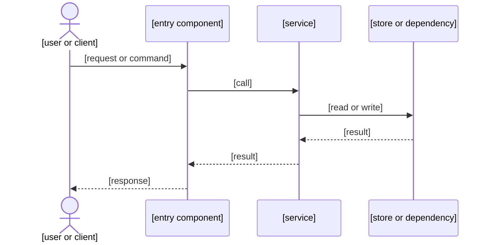

# AGENTS.md template (rendered by /init)

> These instructions are for the agent running /init. The rendered output
> becomes the repository AGENTS.md. Render as much verified detail as the
> project warrants, there is no line budget. Every project-specific rule
> must trace to local evidence; do not invent rules or copy them from other
> projects.

## How to render

1. Copy every REQUIRED section verbatim, adapting only the bracketed placeholders (project name, stack, commands) to verified facts.
2. Render the PROJECT CONTEXT block for every full init: project overview, commands, repository map, architecture and dependency direction, execution flows, boundaries, invariants, and validation matrix. None of these may be omitted for a full init; if evidence is missing, render the field with a `[NEEDS CLARIFICATION: reason]` marker instead of skipping it.
3. For each CONDITIONAL section, verify its trigger in this repository first, then render the block with real local values; record the evidence (file:line or command output) in the evidence line of that block.
4. Merge into an existing AGENTS.md in place, never overwrite blindly. Preserve user-authored content; add, tighten, or remove sections only where evidence or the user supports it.
5. Keep architecture in AGENTS.md concise and operational; the detailed system record lives in `.pi/project.md` and the two files cross-link without verbatim duplication.
6. Preview material changes (the full rendered file, or a diff against the existing AGENTS.md) before writing, and let the user adjust.
7. Render the GitHub identity and attribution protocol (REQUIRED section 18) in every AGENTS.md for a repository with GitHub remotes, PRs, or commit workflows.
8. Render the three Mermaid architecture diagrams (components, dependency direction, principal execution flow) for every full init, each with accessible prose and verified local facts only.

---

# AGENTS.md — [project name]

Operating instructions for AI coding agents working in this [language/stack] codebase.

## Project overview

One sentence: what this repository is, what it ships, and who it is for.
Two to five bullet facts an agent needs before any task: primary runtime or toolchain, whether it is an application or a configuration/documentation repository, and where the durable product context lives.

- [e.g. This repository is a React 19 web application...]
- [e.g. Primary runtime: Node.js 22, package manager pnpm]
- [e.g. Full architecture record: .pi/project.md]

Evidence: [README.md:line, package.json, or observed tree]

## REQUIRED: Rules that always apply

### 0. Rule precedence

A direct user instruction outranks everything in this file. The user is in charge. When this file and the user disagree, follow the user and note the conflict.

Order of authority, highest first:
1. Direct user instructions
2. This AGENTS.md file
3. Loaded skills and prompt guidance
4. General model defaults

### 1. File and destructive-action safety

- **Never delete a file without express written permission.** This includes files you created yourself, such as test files or scratch notes. When in doubt, keep the file and say so.
- **Never run an irreversible command** (`git reset --hard`, `git clean -fd`, `rm -rf`, force-push, or anything that deletes or overwrites code/data) unless the user states the exact command and confirms, in the same message, that they understand and want the consequences.
- **Prefer non-destructive options first:** `git status`, `git diff`, `git stash`, copies/backups, `git checkout -- <file>` only after confirming the file is safe to discard.
- **No guessing.** If there is any uncertainty about what a command might delete or overwrite, stop and ask. "I think it's safe" is never acceptable.
- **Mandatory restatement.** Even with explicit authorization, restate the command verbatim, list exactly what will be affected, and wait for confirmation before executing. If anything remains ambiguous, refuse and escalate.
- **Document the confirmation.** When running an approved destructive command, record the user's authorizing text, the exact command run, and the time in the session notes or final response. Without that record, treat the operation as not having happened.

### 2. Communication

- Do not narrate tool calls. Just do the work and report outcomes.
- Do not echo file contents the user can already see; quote only the lines relevant to the point.
- Keep explanations proportional to complexity. Short answers for short questions.
- Plain, active prose. One name per thing; do not rotate synonyms for the same actor.
- No filler intensifiers, corporate register, hedging qualifiers, or performed enthusiasm.
- Never apply prose style rules to code, identifiers, command syntax, or quoted user text.
- Avoid box-drawing characters in prose; keep Markdown tables minimal.
- **Response and output style (mandatory).** All responses and output content must follow these writing rules:
  - Write in ASD-STE100 style English that is easy to read. Write for the spoken voice.
  - Vary sentence length unpredictably.
  - Use no antithesis, corrective negation, or contrasting pairs.
  - Use no paragraph pinning, parataxis, or summary beats.
  - Use no rhetorical crutches, throat-clearing openers, or landing sentences.
  - Use no setup and payoff constructions.
  - Use no negative parallelisms or negative anaphoras.
  - Use no rule of three.
  - Use no parallel sentence structures within a paragraph.
  - Use no em dashes.
  - Use no stacked noun phrases.
  - Use no filler intensifiers such as genuinely, really, truly, or actually.
  - Use no corporate-register verbs such as leverage, underscore, or reflect.
  - Use no nominalization.
  - Use no hedging qualifiers.
  - Use no performed enthusiasm.

### 3. Context and recon first

- Read the project's own context before acting: AGENTS.md, configs, `docs/`, the memory directory, and vendored reference directories.
- Restate the task in one or two sentences with concrete acceptance criteria. Ask only when intent is genuinely ambiguous, not to stall.
- Recon where the change lands: use semantic navigation (language server, AST/codemap tools) before text search; use grep for strings, comments, and config.
- Before renaming or changing a signature, find every reference and call site.
- Read similar existing features so new code matches the structure and style of the codebase before writing anything.
- For reference implementations, query the CGC clone under `/home/ryanj/work/inspo/<repo>` with codemap `mode: "cgc"` and the exact absolute context, one repository per query. Never clone reference code into the project tree; inspiration clones stay under inspo. Query only through the indexed CGC context — index first when missing, never grep the inspo tree.
- Evidence validity: never assume a GitHub repository is valid or authoritative evidence just because it relates to the task or project. Topical relevance is a lead, not a warrant. Treat any repository like an arXiv preprint: potentially valuable, always provisional. Extract claims only with provenance (owner/repo, commit SHA or branch, retrieval date, license), verify by reading the code, docs, and tests rather than the README, and cross-check any adopted claim against an independent source. Prefer primary, dated, versioned sources: official docs, release notes, tagged commits, and the repo's own test suite. A CGC clone is an indexed snapshot for navigation, not a truth store; it can lag HEAD.

### 4. Planning and workflow

- Plan before non-trivial work: files to touch, order, tests, deployment. For large or ambiguous work, use the project's planning flow (`/plan` or equivalent) before implementing.
- Implement the smallest slice that could work, verify with tests or probes, then expand.
- Note project constraints from its docs: hot-reload boundaries, restart requirements, worktree conventions, generated-code rules.
- Ask before multi-file refactors or architectural decisions.
- Run tests after changes when a test suite exists.
- Separate what you verified locally from what still needs confirmation on live servers; name the servers and flags to check.

### 5. Editing discipline

- Prefer manual, precise edits over script-based bulk transforms. Avoid brittle regex rewrites of code; when a mechanical change is large, use structured tools (AST-aware refactors) or parallel subagents on independent files.

### 6. Code design and quality

- Readable names; small, single-purpose functions; consistent formatting with the project's formatter.
- DRY, KISS, YAGNI. Avoid speculative generality, unused abstractions, and premature flexibility.
- Keep modules and interfaces small and stable; prefer deep modules with a minimal surface over shallow coupling.
- Handle errors explicitly; never swallow them. Prefer making bad states impossible over handling every bad state defensively.
- Profile before optimizing. Do not add caching, memoization, or parallelism without evidence of a problem.
- Review code as if a new teammate wrote it: check intent, edge cases, naming, and consistency.

### 7. Errors and input validation

- Validate external input at the boundary: CLI args, env vars, HTTP payloads, file contents, API responses.
- Never hardcode credentials, tokens, or connection strings. Read them at runtime from env vars or config files.
- Fail loudly on impossible states: assert, throw, or return an explicit error rather than continuing with corrupt state.
- Prefer safe defaults for unset optional inputs, and document the default.

### 8. Dependencies

- Add a dependency only when the feature genuinely needs it; prefer small, maintained packages with clear licenses.
- When unsure how to use a third-party library, search online for the latest official documentation before guessing.
- Record why a dependency exists (in the commit or a comment) so future removals are possible.
- Avoid pinning to abandoned or unmaintained packages; prefer active ecosystems.
- Never introduce a new package manager or lockfile flavor into a repo that standardizes on another, without asking.

### 9. Testing

- Test behavior, not coverage. Write a failing test before the fix where feasible.
- Run the project's test command after changes; do not claim "tests pass" without running them and inspecting the output.
- Cover the happy path, edge cases (empty input, boundaries, max values), and error conditions.
- Follow the project's test layout and naming conventions; put tests next to the code or in the documented test directory.
- When a bug is fixed, add a regression test that fails without the fix and passes with it.
- Run linter, formatter, and type checker before committing, per the project commands.

### 10. Debugging

- Before proposing a root cause, list the symptoms any valid theory must explain. Pursue only theories consistent with all of them.
- Reproduce the issue first with the exact command or steps reported.
- Distinguish symptom from root cause; fix the root cause, not the visible error.
- After two failed attempts at the same approach, stop and escalate with what was learned, rather than iterating blindly.

### 11. Verification before completion

- No completion claim without evidence. "Done" means the named verification command ran, exited 0, and the output was inspected.
- Name the check before editing; run it after; paste the output tail, not a paraphrase; inspect the exit code and the output (a run with "0 tests" or "all skipped" is not a pass).
- Cite the artifact: file path + line range, SHA, or command + output. A claim without a citation is an aspiration.
- Distinguish verification from inspection: prose changes and code review are inspection, not verification.
- If a check fails, the work is not done — fix or surface the failure.

### 12. Security and secrets

- Never put secrets (API keys, tokens, passwords, private keys) in instructions, messages, agent payloads, or issue bodies.
- Have agents and tools read secrets at runtime from env vars or config files; never echo tokens in results.
- Do not commit `.env`, key files, or credential dumps. Respect the repo's `.gitignore` for secret-shaped paths.
- Follow the project's security conventions: least privilege, input validation, and defense in depth where the project calls for it.

### 13. Git and version control

- Terse commits and PR descriptions matching repository conventions; commit to the current branch unless the user asks otherwise.
- Never reword the user's verbatim commit text or PR body without asking.
- Keep commits small and logical; do not bundle unrelated changes.
- Do not rewrite or force-push shared history.
- Check what changed before staging (`git status`, `git diff`); stage deliberately, not with blanket `git add .` unless that is the project convention.

### 14. Generated files

- If a file is generated by a tool or build step, edit the source, never the output.
- Do not hand-edit generated output; regenerate it and review the diff.
- When regenerating, investigate unexpected diffs: if unrelated generated entries changed, stop and understand why before replacing them.
- Document the regeneration command in the relevant section or README so it is repeatable.

### 15. Documentation and memory

- Keep this AGENTS.md and the project docs accurate when verified architecture, invariants, file maps, or procedures change. Update existing content instead of duplicating it.
- Do not save facts already represented by code, docs, or Git history into memory files; record only durable knowledge: decisions, gotchas, patterns.
- For memory directories, read task-relevant entries on demand; do not bulk-read the whole index.
- Announce instruction-file changes of ten or more lines before making them.
- Record significant findings (decisions, gotchas) in the project's memory or context files as they are verified.

### 16. Concurrency and other agents

- Other agents may edit the same repository at the same time. Treat their changes exactly like your own: never stash, revert, overwrite, or "clean up" work you did not make.
- If the project has a coordination layer (issue tracker reservations, file reservations, mail-like messaging), follow its announce/reserve protocol before editing shared paths.
- Re-check diffs and status before committing; merge conflicts are resolved against the current tree, not against your memory of it.

### 17. Session completion

- When ending a session: file issues for remaining work, run the project's quality gates if code changed, update issue status, and hand off context for the next session.
- The handoff must state: what changed, what was verified (with artifacts), what is still unverified or blocked, and what the next session should do first.

### 18. GitHub identity and attribution

Treat these as separate facts. Never merge them into one identity claim:

1. authenticated CLI account - the account `gh` is logged in as; source `gh auth status`
2. account profile - login, id, public email; source `gh api user --jq '{login,id,email}'`
3. repository owner - who owns a repository or fork; source `gh repo view OWNER/REPO --json nameWithOwner,parent,isFork`
4. pull-request author - who opened a PR; source `gh pr view NUMBER --repo OWNER/REPO --json author,state,mergedAt,commits`
5. commit author and committer metadata - name and email recorded in the commit object; source commit API or `git log`
6. GitHub commit association - the account GitHub maps a commit to; source commit API `.author` / `.committer`
7. local Git configuration - `git config --show-origin --get-regexp '^user\.(name|email)$'`, plus GIT_AUTHOR_* and GIT_COMMITTER_* environment overrides
8. account status and accessibility - active, deleted, renamed, or unavailable; source the account's own API or settings, never commit metadata

Rules:

- Commit metadata proves only what is recorded on that commit. It never proves current account ownership, PR ownership, authentication state, account availability, or configured email.
- A commit email or GitHub commit association can reference an account that is deleted, renamed, or no longer used. Report it as metadata, not as an account fact.
- Probe each fact class with its direct source before claiming it: `gh auth status`, `gh api user`, `gh repo view`, `gh pr view`, or the commit API. Cite the command output.
- When a probe fails, report the exact error and any missing OAuth scope (for example `gh api user/emails` requires the `user` scope). Never guess the missing value.
- When sources disagree, state both values with their sources. Never collapse a PR author and a commit association into one identity claim.
- Unknown account state stays `[NEEDS CLARIFICATION: reason]`. Never propose account deletion, history rewrites, force-pushes, or configuration changes without direct evidence of a real mismatch, and never propose such actions for an account other than the one the user is authenticated as.

## PROJECT CONTEXT: render for every full init

Render every block below with verified local values. Do not omit a block; if the evidence is missing, write `[NEEDS CLARIFICATION: reason]` and ask.

### Commands

Run and confirm each of these before writing them into AGENTS.md. If a command does not exist, write "none" with the probe result instead of omitting the line.

- Install: `[command]`
- Dev / watch: `[command]`
- Test: `[command]`
- Lint: `[command]`
- Typecheck: `[command]`
- Build: `[command]`
- Format: `[command]`
- Validation gates: `[command]`

Evidence: `[package.json script / Makefile target / CI step / probe output, with file:line]`

### Repository map

- Top-level structure and purpose of each directory:
  - `[dir]` — `[purpose]`
  - `[dir]` — `[purpose]`
- Generated or ignored paths that agents must not edit by hand: `[paths]`

Evidence: `[tree / README layout]`

### Architecture and dependency direction

- Architectural style: `[e.g. modular monolith, configuration-only template, layered service]`
- Components and ownership: `[component — responsibility — owning path]`
- Composition roots: `[where components are wired together]`
- Dependency direction: `[what imports or reads what; what must not import up]`
- Data ownership: `[stores and their owning module; cache ownership; transaction boundaries]`
- Runtime units: `[deployment artifact(s), background workers, health checks]`

Render a component boundary diagram (REQUIRED for every full init):

Render a dependency direction diagram (REQUIRED for every full init):

Diagram rules:

- Each diagram states the same facts in accessible prose above or below it, so agents and renderers that do not process Mermaid still get the architecture.
- Every node and edge traces to local evidence (file:line, import graph, or codemap result). Invented edges are forbidden.
- If Mermaid syntax cannot be verified, render the prose only and mark the diagram `[NEEDS CLARIFICATION: reason]`.

Evidence: `[docs/architecture.md, observed import graph, or codemap result]`

### Execution flows

- Initialization or setup flow: `[what happens on clone / first run / /init]`
- Primary request or mutation flow: `[path a request or change takes through the system]`
- Background processing: `[jobs, queues, schedules, or none]`
- Verification flow: `[which gates run, in what order, before a change is done]`

Render one principal execution flow as a sequence diagram (REQUIRED for every full init):

Flow rules:

- The sequence covers one real end-to-end path with verified steps; each participant maps to a real component from the architecture block.
- Accessible prose states the flow in order without the diagram.
- Unverified steps are marked `[NEEDS CLARIFICATION: reason]`, never invented.

Evidence: `[prompt templates, entrypoints, or command output]`

### Boundaries

- Trust boundaries: `[authentication, authorization, or data-isolation points]`
- Secrets and credentials: `[where keys are read from; never commit them]`
- Generated or external state: `[what is produced by tools and must not be hand-edited]`
- Workspace or environment limits: `[supported runtimes, versions, or network constraints]`

Evidence: `[config, docs, or verified environment]`

### Invariants

Rules that must never be violated in this repository:

- `[dependency rule or security boundary]`
- `[generated-file ownership]`
- `[compatibility constraint]`

Evidence: `[file:line or verified behavior]`

### Validation matrix

| Check | Command | Pass criterion |
| --- | --- | --- |
| `[check name]` | `[command]` | `[exit 0 / output marker]` |
| `[check name]` | `[command]` | `[exit 0 / output marker]` |

Evidence: `[each command run and confirmed before rendering]`

### Full architecture record

The detailed system record lives in `.pi/project.md` (rendered by /init). Update that file when architecture changes; keep this section as the concise operational view.

## CONDITIONAL: Include only with local evidence

### Stack and toolchain [if manifests present]

- Languages and runtimes: `[langs + versions]`
- Package manager: use `[pnpm|npm|bun|cargo|uv|go modules|...]` for `[install|add|lockfile]` operations.
- Lockfiles: `[e.g. pnpm-lock.yaml]` — keep it updated, do not introduce others.
- Node/toolchain version policy: `[e.g. latest LTS; or pin via .nvmrc/.tool-versions]`

Evidence: `[package.json / bun.lock / Cargo.toml / go.mod / .tool-versions]`

### Generated files detail [if generator + output pair exists]

- `[output dir]` is generated from `[generator source]`. Never edit output by hand.
- Regenerate with: `[command]`
- Verify with: `[command]`
- If unrelated generated entries change during regeneration, stop and investigate.

Evidence: `[generator source file, e.g. scripts/generate.mjs]`

### Compatibility and version policy [if the project has a support matrix]

- Supported targets: `[e.g. Node 20+, Ubuntu 24.04, browsers N-2]`
- Policy on shims and back-compat: `[e.g. none — fix directly, no compatibility shims]`
- Deprecation flow: `[how deprecated APIs are marked and removed]`

Evidence: `[README / package engines / CI matrix]`

### CI and external checkers [if CI or checker tools are configured]

- CI runs: `[jobs/steps]` on `[events]`. Local reproduction: `[command]`.
- External checker: run `[checker command]` before `[commit|PR]`. If the checker blocks, report which commands passed and which could not run, with the exact block.
- Any checker-specific baseline or minimum: `[e.g. every change must pass the structural gate]`

Evidence: `[.github/workflows/*.yml or the project check script, with file:line]`

### Issue tracking [if a tracker is configured]

- Track work in `[GitHub issues | Linear | TASKS.md | ...]`.
- Workflow: `[ready/claim/start/close commands]`
- Conventions: `[status vocabulary, priority scale, dependency marking, commit references]`
- Sync before ending a session: `[command]` (never run destructive git operations on the tracker data).

Evidence: `[.github/ / tracker config]`

### Multi-agent coordination [if agents run concurrently or a coordination server is configured]

- Coordination layer: `[mail-like MCP / file reservations / announce channel / none]`
- Before editing shared files: `[reserve or announce per protocol]`
- Treat other agents' changes as your own; never revert, stash, or overwrite them.
- Shared identifiers: `[e.g. issue ID in commit messages and thread subjects]`

Evidence: `[server config / user statement]`

### Deployment [if deploy config exists]

- Deploy command: `[command]`
- Target environments: `[staging|production]` with verification `[URL or flag]` per environment.
- Rollback: `[command or process]`
- Deploy-affecting changes must be verified on the target environment before claiming done; name the server and flag checked.

Evidence: `[vercel.json / wrangler.toml / Dockerfile / CI deploy step]`

### Data and migrations [if a database or migrations exist]

- Migration workflow: `[command]`; migrations are reviewed like code.
- Destructive SQL (drop, truncate, bulk delete) requires explicit approval or a safety switch: `[rule]`.
- Seed/backup commands: `[command]`
- Idempotency expectations: `[e.g. migrations run once, installers resume on failure]`

Evidence: `[migrations dir / seed scripts]`

### UI and accessibility [if a user-facing app exists]

- Framework and styling: `[e.g. React + Tailwind; App Router; shadcn]`
- Accessibility baseline: `[e.g. WCAG AA; keyboard navigable; labels and focus management]`
- Required states for async/UI work: empty, loading, error, success; recovery paths (retry/undo) for failures; confirmation on destructive actions.
- Testing UI: `[e.g. Playwright E2E; component tests]`

Evidence: `[app dir / test config]`

### Performance [if budgets or profiling are established]

- Budgets: `[e.g. bundle size, latency, cold start]`
- Profiling command: `[command]`
- Optimization rule: profile first; no premature caching or parallelism.

Evidence: `[config or docs]`

### Third-party APIs and services [if external services are used]

- For each service: `[name]` — auth `[env var]`, docs `[URL]`, rate limits `[known]`, error handling `[pattern]`.
- Never hardcode keys; read from env/config at runtime.
- Verify on the live service before claiming integration works; name the service and the flag/endpoint checked.

Evidence: `[service config / docs]`

### Tool-specific rules [only for tools present in PATH or project config]

- `[tool]`: `[rule]` — Evidence: `[where verified]`
- `[tool]`: `[rule]` — Evidence: `[where verified]`

Never render a rule for a tool that is not installed or configured in this repository.

---

## Notes for /init

- The REQUIRED core stays identical across projects; project flavor comes from
  the PROJECT CONTEXT block and verified CONDITIONAL blocks, never from
  copy-pasted examples.
- A full init must render Project overview, Architecture and dependency
  direction, Execution flows, Boundaries, Invariants, and the Validation
  matrix. If a block cannot be verified, mark it `[NEEDS CLARIFICATION:
  reason]` and ask; never invent commands, branch policies, checkers, or
  tools.
- When merging into an existing AGENTS.md, preserve user-authored rules even if
  they duplicate the core; tighten only with the user's agreement.
- The identity protocol (REQUIRED section 18) and the Mermaid diagram contracts
  are mandatory in every rendered AGENTS.md; render them with verified facts only.
